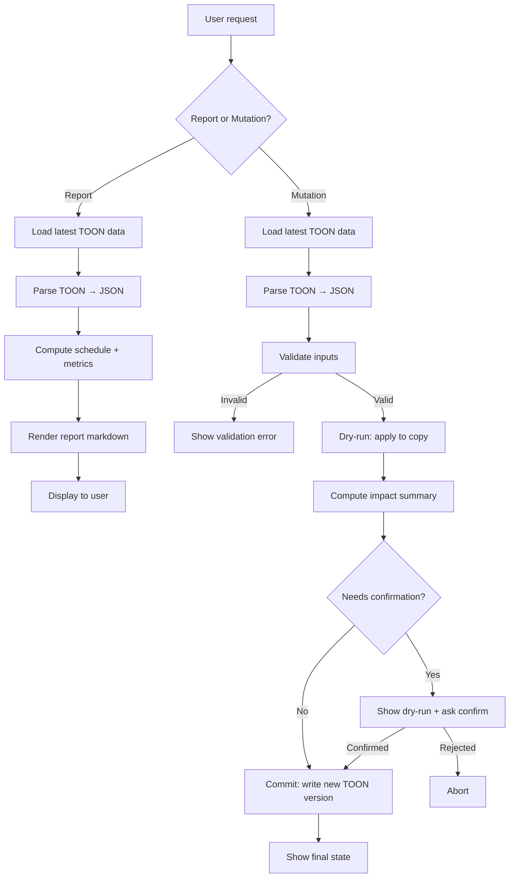

# D2 — Design

**Produced:** 2026-09-19

---

## A. Data Format (TOON)

### Decision

Use **TOON (Token-Optimized Object Notation)** — a simple tab-separated-values (TSV) format with a typed header and `[N]` row-count prefix — for all uniform arrays. Singleton/nested objects (`loanDetails`, `emiReserve`) stay as compact JSON.

**Rationale:** TOON eliminates repeated key names in arrays (which dominate the JSON token cost), achieving ~40-50% token reduction while remaining human-readable and LLM-parseable. TSV is universally understood and requires no custom parser.

**Rejected alternatives:**
- *Minified JSON* — saves bytes but increases tokens only ~20%; still repeats keys per row
- *YAML* — similar token count to JSON; indentation-sensitive; harder for LLMs to edit precisely
- *MessagePack/CBOR* — binary; LLMs cannot read or edit directly
- *CSV* — no type headers; ambiguous quoting rules; no nested value support

### TOON Format Specification

```
[N] entity_name
col1:type	col2:type	col3:type
val1	val2	val3
val1	val2	val3
```

- First line: `[N]` where N is the exact row count, followed by the entity name
- Second line: tab-separated column headers with `:type` suffix (`str`, `num`, `date`, `bool`, `json`)
- Remaining N lines: tab-separated values
- Null/missing values: empty cell
- Strings with tabs/newlines: JSON-encode that cell (prefix with `"`)
- Dates: `YYYY-MM-DD` (type `date`)
- Booleans: `1`/`0` (type `bool`)

### Structures That Convert Well

| Entity | Fields | Rows | Key Advantage |
|---|---|---|---|
| `paymentLog` | 6 fields × 8 rows | 8 | High key:value ratio — 6 keys repeated 8 times in JSON |
| `odBalanceLog` | 3 fields × 9 rows | 9 | Simple uniform rows |
| `contributions` | 5 fields × 21 rows | 21 | Largest array; biggest savings |
| `goals` | 8 fields × 6 rows | 6 | editHistory moved to separate section |
| `sources` | 5 fields × 6 rows | 6 | editHistory moved to separate section |
| `disbursements` | 4 fields × 4 rows | 4 | Small but uniform |
| `rateHistory` | 5 fields × 1 row | 1 | Minimal savings but consistency |
| `prepayments` | 4 fields × 0 rows | 0 | Empty; header-only in TOON |
| `odBalanceAnnotations` | 4 fields × 6 rows | 6 | editHistory moved to separate section |

### Structures That Stay as JSON

| Entity | Reason |
|---|---|
| `loanDetails` | Nested singleton with `policy` sub-object; 1 instance; no repeated keys |
| `emiReserve` | Single scalar value |
| `editHistory` arrays | Variable-length nested arrays within each row; appended as a separate audit-log section |

### Benchmark on Real Data

| Format | `loan_data` bytes | `od_savings` bytes | Total bytes | Est. tokens (÷4) |
|---|---|---|---|---|
| Pretty JSON | 3,448 | 9,879 | 13,327 | ~3,330 |
| Minified JSON | 2,339 | 6,414 | 8,753 | ~2,190 |
| **TOON** | **~1,600** | **~3,800** | **~5,400** | **~1,350** |

TOON achieves approximately **60% reduction** from pretty JSON and **38% reduction** from minified JSON. INFERRED from manual TOON encoding of representative data structures.

### Converter Design

- **Language:** TypeScript (runs in Phase 1 via `tsx`)
- **Module:** `converter.ts` with functions:
  - `jsonToToon(data: LoanData, odData: OdSavingsData): string`
  - `toonToJson(toon: string): { loanData: LoanData; odData: OdSavingsData }`
- **Tests:** Round-trip test: `toonToJson(jsonToToon(data)) === data` for all fields
- **Validation:** `[N]` header count must match actual row count after conversion

### LLM Edit Safety

LLMs editing TOON must keep `[N]` headers consistent. **Decision: all mutations are script-mediated.** The skill never asks Claude to hand-edit TOON. Instead:

1. Skill converts TOON → JSON in memory (via Python engine)
2. Engine applies the mutation to the JSON object
3. Engine converts JSON → TOON for storage
4. `[N]` headers are always recomputed from the actual array lengths

For **Tier C** (no code execution), Claude reads TOON but does not write it. Pre-rendered reports are the primary output.

---

## B. Logic Extraction

### Target Runtime

**Python 3.10+** (default).

**Justification:** Claude Desktop's code execution feature (when available) runs Python. The Python `decimal` module provides precise control over rounding. Python is the most natural scripting language for Claude to verify and debug.

**Rejected alternatives:**
- *TypeScript/Node* — would require `tsx` or `ts-node` in Claude Desktop, which is not available
- *Rust/Go* — compilation step; overkill for single-user financial calculations
- *Spreadsheet formulas* — not programmable enough for the day-by-day loop

### Module Boundaries

```
engine/
├── __init__.py
├── types.py          # Pydantic models (mirror of Zod schemas)
├── schedule.py       # generateSchedule() → list[AmortizationRow]
├── metrics.py        # calculateMetrics() → SummaryMetrics
├── emi.py           # calculateEmi(), calculateTenure()
├── operations.py    # All mutation operations (add_disbursement, etc.)
├── renderer.py      # Deterministic markdown report rendering
├── converter.py     # JSON↔TOON conversion
└── tests/
    ├── fixtures/     # Golden fixtures (JSON) generated by TS
    ├── test_parity.py
    └── test_operations.py
```

### Language-Neutral Logic Spec

The logic spec is a separate document (`logic-spec.md`) containing:

1. **EMI formula:** `EMI = P × r × (1+r)^n / ((1+r)^n - 1)` where `r = annualRate / 12 / 100`, rounded to nearest integer via `round()` (banker's rounding NOT used; standard half-up rounding)
2. **Tenure formula (inverse):** `n = ceil(ln(EMI / (EMI - P×r)) / ln(1+r))`. Returns `Infinity` if `EMI <= P×r`.
3. **Daily interest accrual:** For each day between two due dates: `dailyRate = getRateAt(date) / 100 / dayCountConvention`. `effectivePrincipal = max(0, outstandingPrincipal - getOdBalanceAt(date))`. `interestAccrued += effectivePrincipal × dailyRate`.
4. **Rounding points:** Interest per period → `round()`. Baseline interest → `round()`. EMI → `round()`. Closing balance → `round()`. Opening balance → `round(outstandingPrincipal + principalPaid)`.
5. **Date rules:** Dates are `YYYY-MM-DD` strings. Due date = `{year}-{month}-{dueDateDay}`. Month increments use `Date(year, month+1, dueDateDay)` semantics (same as JS).
6. **Moratorium transition:** EMI phase begins at `period > moratoriumMonths`. During moratorium, installment = interest only, principal = 0.
7. **Historical overrides:** For dates in `HISTORICAL_PAYMENT_DATES`, use `paymentLog.amountPaid` as interest and `amountDue` as baseline.
8. **Prepayment policy:** `adjust_tenure` → recalculate tenure keeping EMI fixed. `adjust_emi` → decrement tenure, recalculate EMI.
9. **Invariants:** `closingBalance >= 0`. `interestSavings >= 0`. `effectivePrincipal >= 0`. Final row has `closingBalance = 0`.

### `today` Parameter

`today` is always an explicit parameter (`today_date: str` in YYYY-MM-DD format). The engine **never** reads the system clock. The skill passes the current date when invoking the engine.

### Golden Fixture Strategy

1. **Generate fixtures by RUNNING TypeScript** — not by hand-copying dashboard numbers
2. **Tool:** A `generate-fixtures.ts` script that:
   - Imports `generateSchedule`, `calculateMetrics` from `calculations.ts`
   - Runs them on pinned input data across multiple scenarios
   - Writes the full schedule + metrics as JSON to `fixtures/`
3. **Scenarios:**
   - `base` — current real data (4 disbursements, 1 rate, 9 OD snapshots, 0 prepayments)
   - `prepayment` — base + ₹5,00,000 prepayment on 2026-10-01
   - `rate-change` — base + rate drops to 7.0% from 2026-10-01
   - `od-change` — base + OD balance increases to ₹15,00,000 from 2026-10-01
   - `disbursement-during-emi` — base + 5th tranche of ₹10,00,000 on 2027-10-01 (after moratorium)
   - `moratorium-boundary` — base data, verify period 18→19 transition
   - `zero-od` — base with empty `odBalanceLog`
   - `high-prepayment` — prepayment that nearly closes the loan
4. **Pinning:** Each fixture includes the exact input JSON + expected output JSON

### Parity Harness

- `test_parity.py`: For each fixture, runs the Python engine on the input, compares every field of every row against the TS-generated expected output
- **Tolerance rules:**
  - Money fields (`interest`, `principal`, `installment`, `openingBalance`, `closingBalance`): **exact match** (both use `round()` to nearest integer)
  - Date strings: **exact match**
  - `effectivePrincipal`: **exact match**
  - `interestSavings`: **exact match** (derived from rounded values)
  - Floating-point intermediate values are NOT compared — only the rounded outputs

---

## C. Reports

### Report Catalog

#### C.1 Summary Report

**Purpose:** Quick snapshot of loan health — the information a user needs daily.

**Essential fields:**
- Current phase (Moratorium / EMI)
- Outstanding principal
- Effective principal (after OD offset)
- Effective interest rate
- Next due date + amount
- Projected EMI (when EMI phase starts)
- Projected closure date
- Interest paid to date
- Interest saved to date (total + this year)
- Total disbursed / sanctioned
- OD balance (latest)
- EMI reserve
- Allocatable balance
- Over-allocation status

**Deliberately omitted:** Health badge score, days-until-due countdown (date is shown instead), chart visualizations.

**Token budget:** ≤ 400 tokens

**Rendered example (identifiers redacted):**

```markdown
## 📊 LoanLens Summary — 19 Sep 2026

**Phase:** Moratorium (14 of 18 months)

| Metric | Value |
|---|---|
| Outstanding Principal | ₹77,50,687 |
| OD Balance | ₹9,23,964 |
| Effective Principal | ₹68,26,723 |
| Effective Rate | 6.69% |
| Next Due | 10 Oct 2026 · ₹[computed] |
| Projected EMI | ₹91,143 (from Aug 2027) |
| Projected Closure | [computed] |

**Interest:**
| | Amount |
|---|---|
| Paid to Date | ₹[computed] |
| Saved to Date | ₹[computed] |
| Saved This Year | ₹[computed] |
| Total Projected | ₹[computed] |

**OD Waterfall:**
| | Amount |
|---|---|
| OD Balance | ₹9,23,964 |
| EMI Reserve | ₹91,143 |
| Allocatable | ₹8,32,821 |
| Allocated to Goals | ₹8,69,000 |
| ⚠️ Over-allocated | ₹36,179 |

Disbursed: ₹77,50,687 / ₹1,19,65,000 (64.8%)
```

#### C.2 OD Savings Report

**Purpose:** Detailed view of OD account, goals, contributions, and savings impact.

**Essential fields:**
- Waterfall breakdown (same as summary, expanded)
- Goal summary table (name, target, allocated, %, status)
- Recent contributions (last 5, with source)
- Monthly OD balance trend (tabular, last 6 months)
- Contribution breakdown by source (top sources)

**Deliberately omitted:** Full contribution history (available via ledger), MoM bar chart, contribution modal.

**Token budget:** ≤ 600 tokens

**Rendered example (identifiers redacted):**

```markdown
## 💰 OD Savings — 19 Sep 2026

**Goals (6):** 🟢 Met: [N] · 🔴 Unmet: [N]

| Goal | Target | Allocated | Progress |
|---|---|---|---|
| [Goal 1] | ₹X | ₹Y | Z% ✅ |
| [Goal 2] | ₹X | ₹Y | Z% |
| ... | | | |

**Recent Contributions:**
| Date | Amount | Source |
|---|---|---|
| 01 Sep 2026 | ₹99,000 | [Source] |
| ... | | |

**OD Balance Trend:**
| Month | Balance | Deposited |
|---|---|---|
| Sep 2026 | ₹9,23,964 | ₹99,000 |
| Aug 2026 | ... | ... |
| ... | | |
```

#### C.3 Schedule Report (Windowed)

**Purpose:** Forward-looking amortization view — next N installments plus yearly summary.

**Essential fields:**
- Next 6 upcoming installments (period, date, opening, installment, interest, principal, closing, OD savings)
- Yearly rollup (total interest, total principal, closing balance per year)
- Closure summary (final period, date, total interest, total savings)

**Deliberately omitted:** Past rows already paid (available in ledger), full 280+ row schedule.

**Token budget:** ≤ 800 tokens

**Rendered example (identifiers redacted):**

```markdown
## 📅 Amortization Schedule — 19 Sep 2026

**Next 6 Installments:**
| # | Due Date | Opening | Installment | Interest | Principal | Closing | Savings |
|---|---|---|---|---|---|---|---|
| [N] | 10 Oct 2026 | ₹X | ₹Y | ₹Z | ₹0 | ₹X | ₹S |
| ... | | | | | | | |

**Yearly Summary:**
| Year | Total Interest | Total Principal | Year-End Balance |
|---|---|---|---|
| 2026 | ₹X | ₹Y | ₹Z |
| 2027 | ₹X | ₹Y | ₹Z |
| ... | | | |

**Closure:** Period [N] · [Date] · Total Interest: ₹X · Total OD Savings: ₹Y
```

#### C.4 Simulator Report

**Purpose:** Show the impact of hypothetical changes vs. current baseline.

**Essential fields:**
- Scenario description (what changes were applied)
- Comparison table: base vs. simulated for key metrics
- Interest saved/increased
- Tenure change (months earlier/later)
- Projected closure change
- Next 6 installments comparison (base vs. sim, side by side)

**Deliberately omitted:** Interactive scenario builder, chart overlays.

**Token budget:** ≤ 600 tokens

#### C.5 Ledger Report

**Purpose:** Transaction log view — disbursements, payments, OD balance history.

**Essential fields:**
- Disbursement log (date, amount, note)
- Payment log (due date, type, amount due, amount paid)
- OD balance log (date, balance, annotation)

**Deliberately omitted:** Inline edit forms.

**Token budget:** ≤ 500 tokens

### Formatting Rules

- **INR:** Indian digit grouping (`₹12,34,567` not `₹1,234,567`). Use `toLocaleString('en-IN')` style.
- **Dates:** `10 Aug 2026` format (human-readable, not YYYY-MM-DD) in rendered reports.
- **Rendering is DETERMINISTIC:** The renderer function in the Python engine takes computed values and emits the markdown. The LLM does NOT re-derive or re-format numbers. It simply passes the renderer output to the user.

---

## D. Operations (Skill's Write Path)

### Operation Catalog

#### Read Operations

| Op ID | Operation | Inputs | Output |
|---|---|---|---|
| R1 | `show_summary` | `today_date: str` | Summary report markdown |
| R2 | `show_od_savings` | `today_date: str` | OD Savings report markdown |
| R3 | `show_schedule` | `today_date: str, window: int = 6` | Schedule report markdown |
| R4 | `simulate` | `today_date: str, changes: list[ScenarioChange]` | Simulator comparison report |
| R5 | `show_ledger` | `today_date: str` | Ledger report markdown |

#### Mutation Operations

| Op ID | Operation | Inputs | Validation | Confirmation Policy | Audit |
|---|---|---|---|---|---|
| W1 | `update_od_balance` | `date: str, balance: float, source_id: str?, purpose: str?, note: str?` | `balance >= 0`, `<= 10Cr`, 2dp, date required | Auto-confirm | Creates annotation with editHistory |
| W2 | `add_disbursement` | `date: str, amount: float, note: str?` | `amount > 0`, `<= 10Cr`, date required, total ≤ sanctioned | Confirm if amount > ₹10L or total approaches sanctioned | No audit (append-only) |
| W3 | `add_prepayment` | `date: str, amount: float, note: str?` | `amount > 0`, `<= outstanding`, date required | Always confirm (show impact: new tenure, interest saved) | No audit (append-only) |
| W4 | `add_rate_change` | `effective_date: str, annual_rate: float, benchmark: str?, spread: float?` | `rate > 0`, `rate < 30`, date required | Always confirm (show impact: new EMI or tenure) | No audit (append-only) |
| W5 | `update_payment` | `due_date: str, amount_paid: float?, amount_due: float?` | `amount > 0`, `<= 10Cr` | Auto-confirm | No audit |
| W6 | `update_emi_reserve` | `amount: float` | `>= 0`, `<= 10Cr`, 2dp | Confirm if new reserve causes over-allocation | No audit |
| W7 | `add_source` | `name: str, description: str?` | Name 1-60 chars, unique (case-insensitive) | Auto-confirm | editHistory init |
| W8 | `edit_source` | `source_id: str, name: str?, description: str?, is_active: bool?` | Same as add | Auto-confirm | editHistory append |
| W9 | `add_goal` | `name: str, target_amount: float, allocated_amount: float?, target_date: str?, color: str?, note: str?` | target > 0, allocated >= 0, ≤ 10Cr, 2dp | Confirm if allocation causes over-allocation | editHistory init |
| W10 | `edit_goal` | `goal_id: str, patch: dict` | Same as add for changed fields | Confirm if allocation change causes over-allocation | editHistory append |
| W11 | `add_contribution` | `date: str, amount: float, source_id: str, note: str?` | `amount > 0`, source exists, date required | Auto-confirm | editHistory init |
| W12 | `edit_contribution` | `contribution_id: str, patch: dict` | Same as add for changed fields | Auto-confirm | editHistory append |
| W13 | `edit_od_annotation` | `od_balance_log_id: str, source_id: str?, purpose: str?, note: str?` | None on values | Auto-confirm | editHistory append |
| W14 | `process_due_payments` | `today_date: str` | Valid date | Always confirm (show what will be deducted) | Creates paymentLog + odBalanceLog + annotation |
| W15 | `update_settings` | `patch: dict` | Valid field names, numeric ranges | Always confirm (show before/after) | No audit |

### Dry-Run Then Commit Semantics

Every mutation operation follows this protocol:

1. **Load** current data (TOON → JSON)
2. **Validate** inputs against schema
3. **Dry-run:** Apply the mutation to an in-memory copy. Compute the full schedule + metrics on the mutated data.
4. **Render impact summary:** Show what changed (before → after for key metrics). Highlight warnings (over-allocation, approaching sanctioned limit, etc.).
5. **Ask for confirmation** (if required by confirmation policy)
6. **Commit:** Apply mutation to the actual data. Recompute. Convert JSON → TOON. Write to storage. Append to audit log.
7. **Show final state:** Brief confirmation + updated metric summary.

### Impact Summary Template

```markdown
### ✏️ Mutation: [operation_name]
**Input:** [human-readable description]

| Metric | Before | After | Δ |
|---|---|---|---|
| Outstanding Principal | ₹X | ₹Y | ₹Z |
| Projected Closure | [date] | [date] | [months] |
| Total Interest | ₹X | ₹Y | ₹Z |
| OD Savings | ₹X | ₹Y | ₹Z |

⚠️ [Any warnings]

Proceed? [Yes/No]
```

---

## E. Storage and Versioning (Phase 2 Runtime)

### Options Evaluated

| Option | Pros | Cons | Verdict |
|---|---|---|---|
| **Local folder (Claude Desktop filesystem)** | Fast read/write, full control, standard file ops | May not persist across sessions; platform-dependent path | **Recommended** |
| Google Drive (via MCP) | Persistent, cloud-backed | Create/search/read only — no overwrite, no delete. Versioning requires creating new files each time. Search latency. | **Fallback** |
| Claude Artifacts | Built-in persistence | Size limits, no programmatic access, not designed for structured data | Rejected |

### Recommended: Local Folder with Versioned Files

```
~/loanlens/
├── data/
│   ├── loan_data.v003.toon        # Current version
│   ├── od_savings.v003.toon       # Current version
│   └── manifest.json              # { version: 3, timestamp: "...", checksum: "..." }
├── archive/
│   ├── loan_data.v001.toon
│   ├── loan_data.v002.toon
│   └── ...
├── engine/
│   ├── schedule.py
│   ├── metrics.py
│   └── ...
├── fixtures/
│   └── ...
└── SKILL.md
```

### Versioning Protocol

- Every write increments the version number: `v001`, `v002`, `v003`, ...
- Old versions are moved to `archive/`
- `manifest.json` always points to the current version
- **Concurrency:** Single-user assumption. No locking needed.
- **Rollback:** Copy `archive/data.vN.toon` back to `data/` and update manifest
- **Pruning:** Keep last 10 versions; archive older ones to a zip

### Google Drive Fallback

If local storage is unreliable:
- Store each version as a new file: `loanlens_loan_v003.toon`
- Use `gdrive_search(name="loanlens_loan_v")` to find latest
- Read via `gdrive_read(file_id)`
- No delete/overwrite: old versions accumulate (acceptable for this data volume)

---

## F. Capability Tiers for Phase 2

### Tier A: Code Execution + Persistent Write

**Available:** Python execution via Claude's code interpreter + local filesystem write

| Capability | How |
|---|---|
| Read reports | Engine computes fresh data, renderer produces markdown |
| Mutations | Engine validates + applies + writes TOON to disk |
| Simulator | Engine runs both base and simulated schedules |
| Parity checks | Run parity harness on fixtures |
| TOON management | Full read/write via converter |

**Phase 1 must provide:** Engine code, TOON files, fixtures, SKILL.md

### Tier B: Code Execution, Read-Only Storage

**Available:** Python execution but no persistent file write (e.g., sandboxed interpreter)

| Capability | How |
|---|---|
| Read reports | Engine computes from data pasted into conversation |
| Mutations | Engine computes dry-run; user must manually update TOON file |
| Simulator | Fully functional (compute-only) |

**Phase 1 must provide:** Everything in Tier A + instructions for manual TOON updates

### Tier C: No Code Execution

**Available:** Claude reads TOON + logic spec + pre-rendered reports, reasons using the spec

| Capability | How |
|---|---|
| Read reports | **Pre-rendered** reports from Phase 1 (embedded in the Project or loaded from Drive) |
| Mutations | Claude reasons through the logic spec to produce updated values. User manually edits TOON. **Money math accuracy not guaranteed.** |
| Simulator | Claude applies the spec formulas to estimate impact. **Approximate only.** |

**Phase 1 must provide:** Pre-rendered reports for current data, logic spec, TOON files, and a "manual update" protocol document. **Critical:** Phase 1 must generate enough pre-rendered reports that Tier C is useful for read-only queries without any computation.

### Phase 1 Pre-Generation Requirements (for Tier C)

| Artifact | Purpose |
|---|---|
| `reports/summary_YYYYMMDD.md` | Pre-rendered summary as of fixture date |
| `reports/od_savings_YYYYMMDD.md` | Pre-rendered OD savings report |
| `reports/schedule_YYYYMMDD.md` | Pre-rendered windowed schedule |
| `reports/ledger_YYYYMMDD.md` | Pre-rendered ledger |
| `logic-spec.md` | All formulas for reasoning fallback |
| `fixtures/*.json` | Golden reference data for verification |

---

## G. Skill Design

### SKILL.md Structure

```markdown
# LoanLens — Home Loan Tracker

## Description
Tracks an OD-linked home loan, computes amortization schedules,
manages OD savings goals, and simulates scenarios.

## Trigger
Activate when the user asks about their home loan, EMI, OD savings,
interest calculations, or wants to update loan data.

## Protocol
1. Resolve latest data version from manifest.json
2. Load TOON files → parse to JSON
3. Compute schedule + metrics via engine
4. Render the requested report OR apply mutation
5. If mutation: dry-run → confirm → commit → show impact

## Available Operations
[List of R1-R5, W1-W15 with brief descriptions]

## Formatting Rules
- Currency: INR with Indian digit grouping (₹12,34,567)
- Dates: "10 Aug 2026" in reports, YYYY-MM-DD in data
- Reports are rendered by the engine, not composed by the LLM
- Never expose account numbers or personal identifiers

## Error Handling
- If data file is missing: report the error, suggest restore from archive
- If validation fails: show the specific validation error and suggest correction
- If computation seems wrong: run parity check against fixtures

## Invariants (checked after every mutation)
- Total disbursed ≤ sanctioned amount
- OD balance ≥ 0
- All goal allocated amounts ≥ 0
- paymentLog dates are unique (one per due date)
- TOON [N] headers match actual row counts
- Round-trip: JSON→TOON→JSON produces identical data
```

### Claude Project Instruction Text

```markdown
You are managing a home loan for the user. The loan data is stored
in TOON format in the data/ directory. Use the LoanLens skill
for all loan-related queries.

Key facts:
- Lender: [REDACTED]
- Loan type: OD-linked home loan (reducing balance)
- Current phase: Moratorium (18 months from first disbursement)
- EMI starts: August 2027
- Rate: 7.6% (RLLR benchmark)
- Day count: 365

Always use today's date when computing reports.
Never copy the account number into conversation text.
For any financial calculation, use the engine — do not estimate.
```

### Protocol Per Conversation



---

## H. Handoff Bundle

### File List and Folder Layout

```
loanlens-bundle/
├── README.md                          # Bundle overview + quick start
├── manifest.json                      # { version, files, checksums, created }
├── SKILL.md                           # Claude skill definition
├── project-instructions.md            # Claude Project instruction text
│
├── data/
│   ├── loan_data.v001.toon            # Current loan data in TOON
│   ├── od_savings.v001.toon           # Current OD savings data in TOON
│   ├── loan_data.json                 # Current data in JSON (reference)
│   └── od_savings_data.json           # Current data in JSON (reference)
│
├── engine/
│   ├── __init__.py
│   ├── types.py                       # Pydantic models
│   ├── schedule.py                    # Schedule generation
│   ├── metrics.py                     # Metrics computation
│   ├── emi.py                         # EMI/tenure calculations
│   ├── operations.py                  # All mutation operations
│   ├── renderer.py                    # Markdown report rendering
│   ├── converter.py                   # JSON↔TOON converter
│   └── auto_deduct.py                 # Payment auto-deduction logic
│
├── spec/
│   ├── logic-spec.md                  # Language-neutral formula spec
│   └── schemas.md                     # Data schema documentation
│
├── fixtures/
│   ├── base.json                      # Base scenario input + expected output
│   ├── prepayment.json
│   ├── rate-change.json
│   ├── od-change.json
│   ├── disbursement-during-emi.json
│   ├── moratorium-boundary.json
│   ├── zero-od.json
│   └── high-prepayment.json
│
├── tests/
│   ├── test_parity.py                 # TS↔Python parity tests
│   ├── test_operations.py             # Operation unit tests
│   ├── test_converter.py              # TOON round-trip tests
│   └── test_renderer.py              # Report rendering tests
│
├── reports/                           # Pre-rendered reports for Tier C
│   ├── summary_20260919.md
│   ├── od_savings_20260919.md
│   ├── schedule_20260919.md
│   └── ledger_20260919.md
│
└── phase2-runbook.md                  # Step-by-step Phase 2 instructions
```

### Manifest Schema

```json
{
  "bundle_version": "1.0.0",
  "created": "2026-09-XX",
  "source_commit": "513bbeb",
  "data_snapshot_date": "2026-09-19",
  "files": [
    { "path": "data/loan_data.v001.toon", "sha256": "...", "bytes": 1600 },
    { "path": "engine/schedule.py", "sha256": "...", "bytes": 0 }
  ],
  "fixture_scenarios": ["base", "prepayment", "rate-change", "od-change", "disbursement-during-emi", "moratorium-boundary", "zero-od", "high-prepayment"],
  "parity_status": "all_passing"
}
```

### Phase 2 Runbook Summary

The Phase 2 runbook (`phase2-runbook.md`) contains numbered steps:

1. **Capability probe** — determine which tier (A/B/C) applies
2. **Install bundle** — copy files to the chosen storage location
3. **Install skill** — paste SKILL.md into Claude Desktop
4. **Create Project** — paste project-instructions.md
5. **End-to-end test** — run each report query, verify against fixtures
6. **Mutation tests** — dry-run + commit for each operation type
7. **Rollback test** — corrupt data, restore from archive
8. **Tuning** — adjust report verbosity, trigger descriptions
9. **Ongoing routine** — monthly bank statement update procedure
