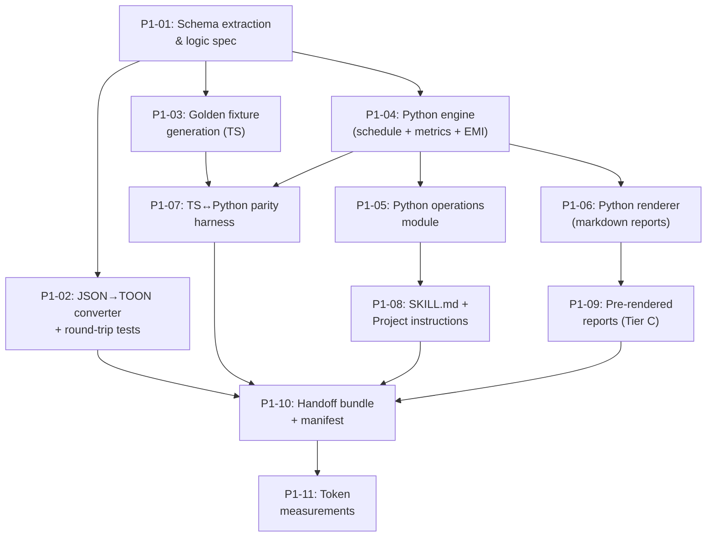

# D3 — Implementation Plan

**Produced:** 2026-09-19

---

## Phase 1: Codebase-Dependent Work (Antigravity CLI, Opus 4.6)

### Milestone Dependency Graph

### Critical Path

**P1-01 → P1-04 → P1-07 → P1-10**

Schema extraction feeds the engine, the engine must pass parity tests before the bundle can be assembled.

### Parallelizable Work

After P1-01 completes, these can run simultaneously:
- **Track A:** P1-02 (converter) — independent of the engine
- **Track B:** P1-03 (fixtures) — needs TS functions only
- **Track C:** P1-04 (engine) → P1-05, P1-06 — depends only on the logic spec

After P1-04 completes:
- P1-05 (operations) and P1-06 (renderer) can run in parallel
- P1-07 (parity) needs both P1-03 and P1-04

### Milestones Detail

#### P1-01: Schema Extraction & Logic Spec
- **Inputs:** Codebase (`types.ts`, `od-savings-types.ts`, `calculations.ts`), D0 change audit, D2 design
- **Outputs:** `spec/logic-spec.md`, `spec/schemas.md`
- **Definition of Done:** Logic spec covers every formula, rounding point, date rule, and invariant. Schemas document every entity with field types and constraints.
- **Acceptance Test:** Manual review — every `Math.round()`, every date operation, every branch in `generateSchedule` is documented.
- **Model:** Opus 4.6 (formula-fidelity work)

#### P1-02: JSON→TOON Converter + Round-Trip Tests
- **Inputs:** `spec/schemas.md`, current data files
- **Outputs:** `engine/converter.ts` (or `.py`), `tests/test_converter.py`, TOON files
- **Definition of Done:** `toonToJson(jsonToToon(data))` is deeply equal to `data` for both files. `[N]` counts are correct. TOON files exist at `data/*.toon`.
- **Acceptance Test:** `python -m pytest tests/test_converter.py` — all pass
- **Model:** Sonnet-class (mechanical transform with strong automated verifier)

#### P1-03: Golden Fixture Generation (TypeScript)
- **Inputs:** Codebase, pinned input data for each scenario
- **Outputs:** `fixtures/*.json` (8 scenario files with input + expected schedule + expected metrics)
- **Definition of Done:** 8 fixture files generated by actually running `generateSchedule()` and `calculateMetrics()` via `tsx`. Every fixture includes the exact input data and complete output.
- **Acceptance Test:** `npx tsx scripts/generate-fixtures.ts` runs without error; output matches what's in `fixtures/`
- **Model:** Sonnet-class (scaffolding + execution)

#### P1-04: Python Engine (Schedule + Metrics + EMI)
- **Inputs:** `spec/logic-spec.md`, `spec/schemas.md`
- **Outputs:** `engine/schedule.py`, `engine/metrics.py`, `engine/emi.py`, `engine/types.py`
- **Definition of Done:** `generateSchedule()` and `calculateMetrics()` produce outputs matching the TypeScript engine for the base fixture.
- **Acceptance Test:** Run engine on base fixture input, compare against expected output — all money fields match exactly.
- **Model:** Opus 4.6 (formula-fidelity, silent errors corrupt money math)

#### P1-05: Python Operations Module
- **Inputs:** D2 Section D (operations catalog), `engine/types.py`
- **Outputs:** `engine/operations.py`, `tests/test_operations.py`
- **Definition of Done:** All 15 write operations (W1-W15) implemented with validation, dry-run, and commit semantics. Tests cover happy path + validation failures.
- **Acceptance Test:** `python -m pytest tests/test_operations.py` — all pass
- **Model:** Sonnet-class (standard implementation + tests, spec is complete)

#### P1-06: Python Renderer (Markdown Reports)
- **Inputs:** D2 Section C (report designs), `engine/types.py`, `engine/metrics.py`
- **Outputs:** `engine/renderer.py`, `tests/test_renderer.py`
- **Definition of Done:** All 5 report types (R1-R5) render correctly with Indian digit grouping, proper date formatting, and within token budgets.
- **Acceptance Test:** `python -m pytest tests/test_renderer.py` — all pass; rendered reports ≤ token budgets
- **Model:** Sonnet-class (templating with strong automated verifier)

#### P1-07: TS↔Python Parity Harness
- **Inputs:** `fixtures/*.json`, Python engine
- **Outputs:** `tests/test_parity.py`
- **Definition of Done:** All 8 fixture scenarios pass parity. Every money field matches exactly. Every date matches exactly.
- **Acceptance Test:** `python -m pytest tests/test_parity.py` — all 8 scenarios pass
- **Model:** Opus 4.6 (reconciling parity failures requires cross-language debugging)

#### P1-08: SKILL.md + Project Instructions
- **Inputs:** D2 Sections G (skill design), all operations and report specs
- **Outputs:** `SKILL.md`, `project-instructions.md`
- **Definition of Done:** SKILL.md is a valid Claude skill definition. Project instructions contain no PII. Both reference the correct file paths.
- **Acceptance Test:** Manual review for completeness and PII absence
- **Model:** Opus 4.6 (skill/protocol design)

#### P1-09: Pre-Rendered Reports (Tier C)
- **Inputs:** Python engine, current data
- **Outputs:** `reports/*.md` (4 report files)
- **Definition of Done:** Reports are rendered from current data, identifiers redacted, within token budgets.
- **Acceptance Test:** Reports exist; token count ≤ limits; no PII
- **Model:** Sonnet-class (mechanical execution)

#### P1-10: Handoff Bundle + Manifest
- **Inputs:** All previous outputs
- **Outputs:** `loanlens-bundle/` directory with all files per D2 Section H
- **Definition of Done:** Manifest lists all files with checksums. Bundle is self-contained — no references to the repo.
- **Acceptance Test:** Verify all files listed in manifest exist; checksums match; `python -m pytest` from within bundle passes all tests
- **Model:** Sonnet-class (assembly + verification)

#### P1-11: Token Measurements
- **Inputs:** TOON files, rendered reports, full bundle
- **Outputs:** Token measurement table appended to manifest
- **Definition of Done:** Token counts measured for: each TOON file, each pre-rendered report, full Project instruction text, total skill context.
- **Acceptance Test:** All measurements recorded; none exceed their budgets
- **Model:** Sonnet-class (measurement)

---

## Phase 2: Claude Desktop (Bundle Only)

### Milestones

#### P2-01: Capability Probe
- **Inputs:** Claude Desktop environment
- **Outputs:** Tier determination (A/B/C)
- **Definition of Done:** Determined which capabilities are available (code execution, file write, file read)
- **Acceptance Test:** Successfully executed a test Python snippet and/or read a test file
- **Model:** Haiku-class (simple diagnostic)

#### P2-02: Install Bundle to Storage
- **Inputs:** `loanlens-bundle/` directory
- **Outputs:** Files in chosen storage location (local folder or Google Drive)
- **Definition of Done:** All bundle files are accessible from Claude Desktop
- **Acceptance Test:** Can read manifest.json and at least one TOON file
- **Model:** Haiku-class (file copy)

#### P2-03: Install Skill
- **Inputs:** `SKILL.md`
- **Outputs:** Skill registered in Claude Desktop
- **Definition of Done:** Skill triggers on loan-related queries
- **Acceptance Test:** Asking "show my loan summary" activates the skill
- **Model:** Haiku-class (configuration)

#### P2-04: Create Project
- **Inputs:** `project-instructions.md`
- **Outputs:** Claude Project created with instructions
- **Definition of Done:** Project contains instructions and references correct file paths
- **Acceptance Test:** Project is active when querying loan data
- **Model:** Haiku-class (configuration)

#### P2-05: End-to-End Test Script
- **Inputs:** Fixtures, expected values
- **Outputs:** Test results for each report query
- **Definition of Done:** All 5 report types return correct data matching fixtures
- **Acceptance Test:** Run each query listed in the test script; compare key values against fixture expectations
- **Model:** Sonnet-class (systematic verification)

#### P2-06: Mutation Dry-Run + Rollback Test
- **Inputs:** Test mutation scenarios
- **Outputs:** Verified mutations + successful rollback
- **Definition of Done:** At least 3 mutations tested (OD balance update, contribution add, goal edit). Rollback restores previous version.
- **Acceptance Test:** Data integrity verified after rollback (matches pre-mutation state)
- **Model:** Sonnet-class (testing)

#### P2-07: Report/Trigger Tuning
- **Inputs:** User feedback on report verbosity and skill triggers
- **Outputs:** Updated SKILL.md and renderer settings
- **Definition of Done:** Reports are at desired verbosity; skill activates reliably
- **Acceptance Test:** User confirms reports are useful
- **Model:** Haiku-class (iterative tuning)

#### P2-08: Ongoing Routine Setup
- **Inputs:** Monthly bank statement update procedure
- **Outputs:** Documented monthly update steps
- **Definition of Done:** User can update loan data after receiving bank statement
- **Acceptance Test:** Successfully complete one monthly update cycle
- **Model:** Haiku-class (documentation)
