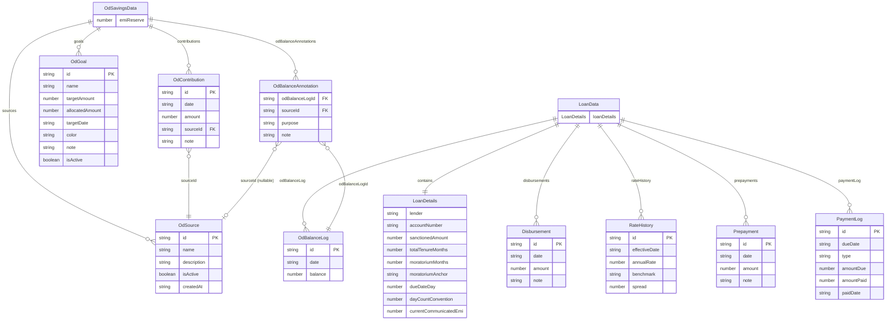

# LoanLens — Data Schema Reference

> **Produced:** 2026-09-25
> **Source commit:** `513bbeb` (branch `main`)
> **Primary sources:**
> - [`types.ts`](file:///home/aditya/codebase/gemini-projects/home-loan-dashboard/src/lib/types.ts) (105 lines) — Loan data schemas
> - [`od-savings-types.ts`](file:///home/aditya/codebase/gemini-projects/home-loan-dashboard/src/lib/od-savings-types.ts) (145 lines) — OD savings schemas & validation helpers

---

## Table of Contents

1. [Shared Validation Helpers](#1-shared-validation-helpers)
2. [Audit Trail](#2-audit-trail)
3. [Loan Data Schemas](#3-loan-data-schemas)
   - 3.1 [DisbursementSchema](#31-disbursementschema)
   - 3.2 [RateHistorySchema](#32-ratehistoryschema)
   - 3.3 [OdBalanceLogSchema](#33-odbalancelogschema)
   - 3.4 [PrepaymentSchema](#34-prepaymentschema)
   - 3.5 [PaymentLogSchema](#35-paymentlogschema)
   - 3.6 [LoanDetailsSchema](#36-loandetailsschema)
   - 3.7 [LoanDataSchema (Root)](#37-loandataschema-root)
4. [OD Savings Schemas](#4-od-savings-schemas)
   - 4.1 [OdSourceSchema](#41-odsourceschema)
   - 4.2 [OdGoalSchema](#42-odgoalschema)
   - 4.3 [OdContributionSchema](#43-odcontributionschema)
   - 4.4 [OdBalanceAnnotationSchema](#44-odbalanceannotationschema)
   - 4.5 [OdSavingsDataSchema (Root)](#45-odsavingsdataschema-root)
5. [TypeScript Interfaces (Non-Zod)](#5-typescript-interfaces-non-zod)
   - 5.1 [AmortizationRow](#51-amortizationrow)
   - 5.2 [SummaryMetrics](#52-summarymetrics)
6. [Constants](#6-constants)
7. [Client Validation Utilities](#7-client-validation-utilities)
8. [Edit History Coverage](#8-edit-history-coverage)
9. [Schema Relationship Diagram](#9-schema-relationship-diagram)

---

## 1. Shared Validation Helpers

### PositiveMoneySchema

**VERIFIED** — [`od-savings-types.ts#L6-L13`](file:///home/aditya/codebase/gemini-projects/home-loan-dashboard/src/lib/od-savings-types.ts#L6-L13)

Used for: deposits, contributions, goal target amounts — any amount that must be strictly positive.

| Constraint | Rule | Error Message |
|---|---|---|
| Type | `z.number()` | `"Amount must be a valid positive number"` |
| Minimum | `.positive()` (> 0) | `"Amount must be greater than zero"` |
| Maximum | `.max(100_000_000)` | `"Amount cannot exceed ₹10 Crore"` |
| Precision | `.refine(v => Math.round(v * 100) === v * 100)` | `"Amount can have at most 2 decimal places"` |

### NonNegativeMoneySchema

**VERIFIED** — [`od-savings-types.ts#L16-L23`](file:///home/aditya/codebase/gemini-projects/home-loan-dashboard/src/lib/od-savings-types.ts#L16-L23)

Used for: OD account balance — allowed to be zero but never negative.

| Constraint | Rule | Error Message |
|---|---|---|
| Type | `z.number()` | `"Balance must be a valid number"` |
| Minimum | `.min(0)` (≥ 0) | `"Balance cannot be negative"` |
| Maximum | `.max(100_000_000)` | `"Balance cannot exceed ₹10 Crore"` |
| Precision | `.refine(v => Math.round(v * 100) === v * 100)` | `"Balance can have at most 2 decimal places"` |

---

## 2. Audit Trail

### AuditRecordSchema

**VERIFIED** — [`od-savings-types.ts#L27-L32`](file:///home/aditya/codebase/gemini-projects/home-loan-dashboard/src/lib/od-savings-types.ts#L27-L32)

Tracks field-level changes for entities that support edit history.

| Field | Type | Constraints | Description |
|---|---|---|---|
| `timestamp` | `string` | Required | ISO timestamp of the change |
| `field` | `string` | Required | Name of the changed field |
| `oldValue` | `string` | Required | Previous value (stringified) |
| `newValue` | `string` | Required | New value (stringified) |

---

## 3. Loan Data Schemas

### 3.1 DisbursementSchema

**VERIFIED** — [`types.ts#L3-L8`](file:///home/aditya/codebase/gemini-projects/home-loan-dashboard/src/lib/types.ts#L3-L8)

Represents a tranche disbursement from the lender.

| Field | Type | Constraints | Default | Description |
|---|---|---|---|---|
| `id` | `string` | Required | — | Unique identifier |
| `date` | `string` | Required | — | Disbursement date (`YYYY-MM-DD`) |
| `amount` | `number` | Required | — | Disbursement amount (₹) |
| `note` | `string` | Optional | — | Free-text note |

**Edit history:** ❌ None

### 3.2 RateHistorySchema

**VERIFIED** — [`types.ts#L10-L16`](file:///home/aditya/codebase/gemini-projects/home-loan-dashboard/src/lib/types.ts#L10-L16)

Represents a step in the interest rate history.

| Field | Type | Constraints | Default | Description |
|---|---|---|---|---|
| `id` | `string` | Required | — | Unique identifier |
| `effectiveDate` | `string` | Required | — | Date the rate takes effect (`YYYY-MM-DD`) |
| `annualRate` | `number` | Required | — | Annual interest rate (e.g. `7.6` for 7.6%) |
| `benchmark` | `string` | Optional | — | Rate benchmark name (e.g. `"RLLR"`) |
| `spread` | `number` | Optional | — | Spread over benchmark (unused in calculations) |

**Edit history:** ❌ None
**Note:** `spread` is defined in the schema but **never referenced** in any calculation. **VERIFIED**

### 3.3 OdBalanceLogSchema

**VERIFIED** — [`types.ts#L18-L22`](file:///home/aditya/codebase/gemini-projects/home-loan-dashboard/src/lib/types.ts#L18-L22)

Snapshot of the OD account balance at a point in time. Uses an absolute-balance model (not deltas).

| Field | Type | Constraints | Default | Description |
|---|---|---|---|---|
| `id` | `string` | Required | — | Unique identifier |
| `date` | `string` | Required | — | Snapshot date (`YYYY-MM-DD`) |
| `balance` | `number` | Required | — | Absolute OD account balance (₹) |

**Edit history:** ❌ None
**Note:** Validated as `NonNegativeMoneySchema` at the server-action level (`addOdBalanceLog`, `addOdBalanceWithAnnotation`), not at the Zod schema level. **VERIFIED**

### 3.4 PrepaymentSchema

**VERIFIED** — [`types.ts#L24-L29`](file:///home/aditya/codebase/gemini-projects/home-loan-dashboard/src/lib/types.ts#L24-L29)

Represents a principal prepayment.

| Field | Type | Constraints | Default | Description |
|---|---|---|---|---|
| `id` | `string` | Required | — | Unique identifier |
| `date` | `string` | Required | — | Prepayment date (`YYYY-MM-DD`) |
| `amount` | `number` | Required | — | Prepayment amount (₹) |
| `note` | `string` | Optional | — | Free-text note |

**Edit history:** ❌ None

### 3.5 PaymentLogSchema

**VERIFIED** — [`types.ts#L31-L38`](file:///home/aditya/codebase/gemini-projects/home-loan-dashboard/src/lib/types.ts#L31-L38)

Records actual payments made (both auto-deducted and manual).

| Field | Type | Constraints | Default | Description |
|---|---|---|---|---|
| `id` | `string` | Required | — | Unique identifier |
| `dueDate` | `string` | Required | — | The due date this payment corresponds to (`YYYY-MM-DD`) |
| `type` | `enum` | `"pre_emi_interest" \| "emi"` | — | Payment type |
| `amountDue` | `number` | Required | — | Amount the bank charged (scheduled installment) |
| `amountPaid` | `number` | Required | — | Amount actually paid |
| `paidDate` | `string` | Required | — | Date payment was made (`YYYY-MM-DD`) |

**Edit history:** ❌ None
**Note:** For auto-deducted payments, `amountDue = amountPaid = row.installment` and `paidDate = dueDate`. **VERIFIED** — [`calculations.ts#L331-L338`](file:///home/aditya/codebase/gemini-projects/home-loan-dashboard/src/lib/calculations.ts#L331-L338)

### 3.6 LoanDetailsSchema

**VERIFIED** — [`types.ts#L40-L55`](file:///home/aditya/codebase/gemini-projects/home-loan-dashboard/src/lib/types.ts#L40-L55)

Core loan configuration.

| Field | Type | Constraints | Default | Description |
|---|---|---|---|---|
| `lender` | `string` | Required | — | Lender name |
| `accountNumber` | `string` | Required | — | Loan account number |
| `sanctionedAmount` | `number` | Required | — | Total sanctioned loan amount (₹) |
| `totalTenureMonths` | `number` | Required | — | Total loan tenure in months |
| `moratoriumMonths` | `number` | Required | — | Number of interest-only (moratorium) months |
| `moratoriumAnchor` | `enum` | `"first_disbursement" \| "account_opening"` | — | What the moratorium period is anchored to |
| `dueDateDay` | `number` | Required | — | Day of month for EMI due date (e.g. `10`) |
| `dayCountConvention` | `number` | `.default(365)` | `365` | Days-in-year for daily rate calculation |
| `currentCommunicatedEmi` | `number` | Required | — | Bank-communicated EMI amount (₹) |
| `policy` | `object` | Required | — | Nested policy object (see below) |

#### Policy Sub-Object

| Field | Type | Constraints | Description |
|---|---|---|---|
| `onRateChange` | `enum` | `"adjust_tenure" \| "adjust_emi"` | What to adjust when rate changes |
| `onDisbursementDuringEmi` | `enum` | `"adjust_tenure" \| "adjust_emi"` | What to adjust on new disbursement during EMI phase |
| `onPrepayment` | `enum` | `"adjust_tenure" \| "adjust_emi"` | What to adjust after prepayment |

**Edit history:** ❌ None
**Note:** `onRateChange` and `onDisbursementDuringEmi` are defined in the schema but **not used** in `generateSchedule`. Only `onPrepayment` is used. **VERIFIED**

### 3.7 LoanDataSchema (Root)

**VERIFIED** — [`types.ts#L57-L64`](file:///home/aditya/codebase/gemini-projects/home-loan-dashboard/src/lib/types.ts#L57-L64)

Top-level schema for `loan_data.json`.

| Field | Type | Constraints | Description |
|---|---|---|---|
| `loanDetails` | `LoanDetailsSchema` | Required | Core loan configuration |
| `disbursements` | `DisbursementSchema[]` | Required (array) | List of tranche disbursements |
| `rateHistory` | `RateHistorySchema[]` | Required (array) | Interest rate change log |
| `odBalanceLog` | `OdBalanceLogSchema[]` | Required (array) | OD account balance snapshots |
| `prepayments` | `PrepaymentSchema[]` | Required (array) | Principal prepayments |
| `paymentLog` | `PaymentLogSchema[]` | Required (array) | Recorded payments |

---

## 4. OD Savings Schemas

### 4.1 OdSourceSchema

**VERIFIED** — [`od-savings-types.ts#L38-L45`](file:///home/aditya/codebase/gemini-projects/home-loan-dashboard/src/lib/od-savings-types.ts#L38-L45)

A funding source for OD contributions (e.g., salary account, savings account).

| Field | Type | Constraints | Default | Description |
|---|---|---|---|---|
| `id` | `string` | Required | — | Unique identifier |
| `name` | `string` | `.min(1)`, `.max(60)` | — | Source name |
| `description` | `string` | `.max(200)`, Optional | — | Description |
| `isActive` | `boolean` | — | `true` | Whether the source is active |
| `createdAt` | `string` | Required | — | Creation timestamp |
| `editHistory` | `AuditRecord[]` | — | `[]` | Field-level change log |

**Edit history:** ✅ Yes — tracked via `diffAudit()` in `editSource()` server action

### 4.2 OdGoalSchema

**VERIFIED** — [`od-savings-types.ts#L73-L83`](file:///home/aditya/codebase/gemini-projects/home-loan-dashboard/src/lib/od-savings-types.ts#L73-L83)

A savings goal with target amount and allocation tracking.

| Field | Type | Constraints | Default | Description |
|---|---|---|---|---|
| `id` | `string` | Required | — | Unique identifier |
| `name` | `string` | `.min(1)`, `.max(80)` | — | Goal name |
| `targetAmount` | `PositiveMoneySchema` | > 0, ≤ ₹10Cr, 2dp max | — | Target savings amount |
| `allocatedAmount` | `NonNegativeMoneySchema` | ≥ 0, ≤ ₹10Cr, 2dp max | `0` | Amount allocated toward goal |
| `targetDate` | `string` | Optional | — | Target completion date |
| `color` | `string` | — | `"#0f766e"` (Teal) | Display colour hex code |
| `note` | `string` | `.max(300)`, Optional | — | Free-text note |
| `isActive` | `boolean` | — | `true` | Whether the goal is active |
| `editHistory` | `AuditRecord[]` | — | `[]` | Field-level change log |

**Edit history:** ✅ Yes — tracked via `diffAudit()` in `editGoal()` server action

### 4.3 OdContributionSchema

**VERIFIED** — [`od-savings-types.ts#L89-L96`](file:///home/aditya/codebase/gemini-projects/home-loan-dashboard/src/lib/od-savings-types.ts#L89-L96)

Records a deposit into the OD account from a specific source.

| Field | Type | Constraints | Default | Description |
|---|---|---|---|---|
| `id` | `string` | Required | — | Unique identifier |
| `date` | `string` | `.min(1)` | — | Contribution date (`YYYY-MM-DD`) |
| `amount` | `PositiveMoneySchema` | > 0, ≤ ₹10Cr, 2dp max | — | Contribution amount |
| `sourceId` | `string` | `.min(1)` | — | FK to `OdSource.id` |
| `note` | `string` | `.max(300)`, Optional | — | Free-text note |
| `editHistory` | `AuditRecord[]` | — | `[]` | Field-level change log |

**Edit history:** ✅ Yes — tracked via `diffAudit()` in `editContribution()` server action

### 4.4 OdBalanceAnnotationSchema

**VERIFIED** — [`od-savings-types.ts#L102-L108`](file:///home/aditya/codebase/gemini-projects/home-loan-dashboard/src/lib/od-savings-types.ts#L102-L108)

Annotates an `OdBalanceLog` entry with purpose and source attribution.

| Field | Type | Constraints | Default | Description |
|---|---|---|---|---|
| `odBalanceLogId` | `string` | Required | — | FK to `OdBalanceLog.id` |
| `sourceId` | `string \| null` | `.nullable()` | `null` | FK to `OdSource.id`, or `null` for system-generated |
| `purpose` | `string` | — | `"savings"` | Purpose label (e.g. `"savings"`, `"EMI / Interest"`) |
| `note` | `string` | `.max(300)`, Optional | — | Free-text note |
| `editHistory` | `AuditRecord[]` | — | `[]` | Field-level change log |

**Edit history:** ✅ Yes — tracked via `diffAudit()` in `editOdBalanceAnnotation()` server action

### 4.5 OdSavingsDataSchema (Root)

**VERIFIED** — [`od-savings-types.ts#L114-L120`](file:///home/aditya/codebase/gemini-projects/home-loan-dashboard/src/lib/od-savings-types.ts#L114-L120)

Top-level schema for `od_savings_data.json`.

| Field | Type | Constraints | Default | Description |
|---|---|---|---|---|
| `emiReserve` | `number` | `.min(0)` | `91143` | Reserved amount for EMI coverage (₹) |
| `sources` | `OdSourceSchema[]` | — | `[]` | Funding sources |
| `contributions` | `OdContributionSchema[]` | — | `[]` | Deposit records |
| `goals` | `OdGoalSchema[]` | — | `[]` | Savings goals |
| `odBalanceAnnotations` | `OdBalanceAnnotationSchema[]` | — | `[]` | Balance annotations |

---

## 5. TypeScript Interfaces (Non-Zod)

These are plain TypeScript interfaces — not Zod schemas, not validated at runtime. They define the shape of computed/derived data.

### 5.1 AmortizationRow

**VERIFIED** — [`types.ts#L74-L86`](file:///home/aditya/codebase/gemini-projects/home-loan-dashboard/src/lib/types.ts#L74-L86)

One row of the amortization schedule (output of `generateSchedule`).

| Field | Type | Description |
|---|---|---|
| `period` | `number` | Period number (1-indexed) |
| `dueDate` | `string` | Due date (`YYYY-MM-DD`) |
| `openingBalance` | `number` | Outstanding balance before this period's payment (rounded) |
| `installment` | `number` | Total payment for this period |
| `interest` | `number` | Interest component of the payment |
| `baselineInterest` | `number` | Interest that would be charged without OD offset |
| `interestSavings` | `number` | `max(0, baselineInterest - interest)` |
| `principal` | `number` | Principal component of the payment |
| `closingBalance` | `number` | Outstanding balance after payment (rounded) |
| `phase` | `"moratorium" \| "emi"` | Current loan phase |
| `effectivePrincipal` | `number` | `max(0, outstanding - odBalance)` at the due date |

### 5.2 SummaryMetrics

**VERIFIED** — [`types.ts#L88-L104`](file:///home/aditya/codebase/gemini-projects/home-loan-dashboard/src/lib/types.ts#L88-L104)

Derived summary statistics (output of `calculateMetrics`).

| Field | Type | Description |
|---|---|---|
| `currentPhase` | `"moratorium" \| "emi"` | Phase of the next due period |
| `outstandingPrincipal` | `number` | Opening balance of the next due period |
| `effectivePrincipal` | `number` | Outstanding minus OD balance for next period |
| `effectiveInterestRate` | `number` | Adjusted annual rate accounting for OD offset |
| `nextDueDate` | `string` | Date of the next due period |
| `nextInstallmentAmount` | `number` | Installment amount for the next period |
| `projectedEmi` | `number` | Expected EMI once the EMI phase begins |
| `projectedClosureDate` | `string` | Due date of the last schedule row |
| `interestPaidToDate` | `number` | Sum of interest in past rows |
| `principalPaidToDate` | `number` | Sum of principal in past rows |
| `totalInterestProjected` | `number` | Sum of interest across all rows |
| `interestSavedTillNow` | `number` | Sum of (baseline − actual) interest in past rows |
| `interestSavedThisYear` | `number` | Sum of (baseline − actual) interest in current-year past rows |
| `disbursedAmount` | `number` | Sum of all disbursement amounts |
| `sanctionedAmount` | `number` | Total sanctioned amount from loan details |

---

## 6. Constants

### GOAL_COLOR_VALUES

**VERIFIED** — [`od-savings-types.ts#L51-L60`](file:///home/aditya/codebase/gemini-projects/home-loan-dashboard/src/lib/od-savings-types.ts#L51-L60)

```typescript
const GOAL_COLOR_VALUES = [
  "#0f766e",  // Teal
  "#2563eb",  // Blue
  "#f59e0b",  // Amber
  "#16a34a",  // Green
  "#e11d48",  // Rose
  "#7c3aed",  // Violet
  "#ea580c",  // Orange
  "#0891b2",  // Cyan
] as const;
```

### GOAL_COLORS

**VERIFIED** — [`od-savings-types.ts#L62-L71`](file:///home/aditya/codebase/gemini-projects/home-loan-dashboard/src/lib/od-savings-types.ts#L62-L71)

Array of `{ value: string, label: string }` objects mapping hex codes to human-readable colour names. Used for UI display.

---

## 7. Client Validation Utilities

These functions mirror `PositiveMoneySchema` / `NonNegativeMoneySchema` validation for client-side form validation without Zod.

### validatePositiveMoney

**VERIFIED** — [`od-savings-types.ts#L126-L134`](file:///home/aditya/codebase/gemini-projects/home-loan-dashboard/src/lib/od-savings-types.ts#L126-L134)

```
validatePositiveMoney(raw: string, label?: string) → string | undefined
```

| Check | Error |
|---|---|
| Empty/blank string | `"${label} is required"` |
| `parseFloat` is NaN | `"${label} must be a valid number"` |
| `n ≤ 0` | `"${label} must be greater than zero"` |
| `n > 100_000_000` | `"${label} cannot exceed ₹10 Crore"` |
| `Math.round(n * 100) !== n * 100` | `"${label} can have at most 2 decimal places"` |

Returns `undefined` if valid.

### validateNonNegativeMoney

**VERIFIED** — [`od-savings-types.ts#L136-L144`](file:///home/aditya/codebase/gemini-projects/home-loan-dashboard/src/lib/od-savings-types.ts#L136-L144)

```
validateNonNegativeMoney(raw: string, label?: string) → string | undefined
```

| Check | Error |
|---|---|
| Empty/blank string | `"${label} is required"` |
| `parseFloat` is NaN | `"${label} must be a valid number"` |
| `n < 0` | `"${label} cannot be negative"` |
| `n > 100_000_000` | `"${label} cannot exceed ₹10 Crore"` |
| `Math.round(n * 100) !== n * 100` | `"${label} can have at most 2 decimal places"` |

Returns `undefined` if valid.

---

## 8. Edit History Coverage

Summary of which entities support field-level audit trails via `editHistory: AuditRecord[]`.

| Entity | Has `editHistory`? | Tracked By |
|---|---|---|
| `Disbursement` | ❌ No | — |
| `RateHistory` | ❌ No | — |
| `OdBalanceLog` | ❌ No | — |
| `Prepayment` | ❌ No | — |
| `PaymentLog` | ❌ No | — |
| `LoanDetails` | ❌ No | — |
| `OdSource` | ✅ Yes | `editSource()` via `diffAudit()` |
| `OdGoal` | ✅ Yes | `editGoal()` via `diffAudit()` |
| `OdContribution` | ✅ Yes | `editContribution()` via `diffAudit()` |
| `OdBalanceAnnotation` | ✅ Yes | `editOdBalanceAnnotation()` via `diffAudit()` |

**Pattern:** Only entities in `od_savings_data.json` that support editing have audit trails. All loan-core entities (`loan_data.json`) lack edit history. **VERIFIED**

---

## 9. Schema Relationship Diagram



### Cross-File Relationships

| FK Field | Source Entity | Target Entity | Target File | Nullable? |
|---|---|---|---|---|
| `OdContribution.sourceId` | `OdContribution` | `OdSource` | Same (`od_savings_data.json`) | No (`.min(1)`) |
| `OdBalanceAnnotation.odBalanceLogId` | `OdBalanceAnnotation` | `OdBalanceLog` | Cross-file (`loan_data.json`) | No |
| `OdBalanceAnnotation.sourceId` | `OdBalanceAnnotation` | `OdSource` | Same (`od_savings_data.json`) | Yes (`.nullable()`) |

---

## Schema Count Summary

| Source File | Zod Schemas | TS Interfaces | Total |
|---|---|---|---|
| `types.ts` | 7 (`Disbursement`, `RateHistory`, `OdBalanceLog`, `Prepayment`, `PaymentLog`, `LoanDetails`, `LoanData`) | 2 (`AmortizationRow`, `SummaryMetrics`) | 9 |
| `od-savings-types.ts` | 8 (`PositiveMoney`, `NonNegativeMoney`, `AuditRecord`, `OdSource`, `OdGoal`, `OdContribution`, `OdBalanceAnnotation`, `OdSavingsData`) | 0 | 8 |
| **Total** | **15** | **2** | **17** |

> **Note on "13 Zod schemas" target:** The task prompt references 13 Zod schemas. The actual count is **15** Zod schemas (7 in `types.ts` + 8 in `od-savings-types.ts`), plus the nested `policy` sub-object in `LoanDetailsSchema` which is an inline `z.object()` rather than a named schema. All 15 are documented above. **VERIFIED**
